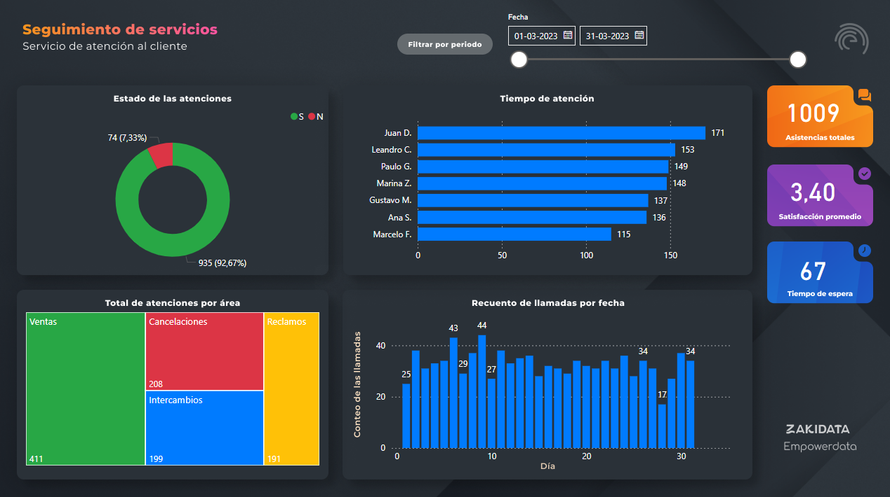

# Análisis Logístico - Seguimiento de Servicios 📊  

Este proyecto tiene como objetivo analizar y visualizar los datos del **Call Center** de una empresa utilizando **Power BI**. Se realizaron diversas transformaciones y visualizaciones para mejorar la interpretación de la información y la toma de decisiones.  

## 📂 Estructura del Proyecto  

- **📁 imágenes/** → Carpeta con capturas de los paneles interactivos creados en Power BI.  
  - 📸 `Dashboard.png` → Captura principal del dashboard.  
- **📁 datos/** → Contiene el archivo **Excel** con los datos analizados.  
- **📄 análisis_exploratorio.md** → Documento con el análisis inicial de los datos.  

## ⚡ Proceso de Análisis  

1. **Importación de datos** desde archivos Excel.  
2. **Transformación de datos**:  
   - Reemplazo de valores en la columna **"Área"**.  
   - Conversión de nombres en **mayúsculas** en la columna **"Área"**.  
   - División de la columna **"Respondido - Resuelto (S/N)"** por delimitador.  
   - Eliminación de columnas innecesarias.  
3. **Creación de gráficos en Power BI**:  
   - 📊 **Recuento de llamadas** (ID de llamada).  
   - ⭐ **Promedio de satisfacción** (Índice de satisfacción).  
   - ⏳ **Tiempo de espera en segundos** (Velocidad de respuesta).  
   - 🟢🔴 **Estado de atención** (Gráfico de anillos con ID de llamada y estado resuelto).  
   - 📞 **Llamadas por asistente** (Gráfico de barras apiladas con Asistente e ID de llamada).  
   - 📌 **Distribución de áreas** (Gráfico de treemap con Ventas, Intercambios, Cancelaciones y Reclamos).  
   - 📅 **Recuento de llamadas por día** (Gráfico de columnas agrupadas con Fecha e ID de llamada).  

## 🛠 Herramientas Utilizadas  

- **Power BI** →# Análisis Logístico - Seguimiento de Servicios 📊  

Este proyecto tiene como objetivo analizar y visualizar los datos del **Call Center** de una empresa utilizando **Power BI**. Se realizaron diversas transformaciones y visualizaciones para mejorar la interpretación de la información y la toma de decisiones.  

## 📂 Estructura del Proyecto  

- **📁 imágenes/** → Carpeta con capturas de los paneles interactivos creados en Power BI.  
  - 📸 `Dashboard.png` → Captura principal del dashboard.  
- **📁 datos/** → Contiene el archivo **Excel** con los datos analizados.  
- **📄 análisis_exploratorio.md** → Documento con el análisis inicial de los datos.  

## ⚡ Proceso de Análisis  

1. **Importación de datos** desde archivos Excel.  
2. **Transformación de datos**:  
   - Reemplazo de valores en la columna **"Área"**.  
   - Conversión de nombres en **mayúsculas** en la columna **"Área"**.  
   - División de la columna **"Respondido - Resuelto (S/N)"** por delimitador.  
   - Eliminación de columnas innecesarias.  
3. **Creación de gráficos en Power BI**:  
   - 📊 **Recuento de llamadas** (ID de llamada).  
   - ⭐ **Promedio de satisfacción** (Índice de satisfacción).  
   - ⏳ **Tiempo de espera en segundos** (Velocidad de respuesta).  
   - 🟢🔴 **Estado de atención** (Gráfico de anillos con ID de llamada y estado resuelto).  
   - 📞 **Llamadas por asistente** (Gráfico de barras apiladas con Asistente e ID de llamada).  
   - 📌 **Distribución de áreas** (Gráfico de treemap con Ventas, Intercambios, Cancelaciones y Reclamos).  
   - 📅 **Recuento de llamadas por día** (Gráfico de columnas agrupadas con Fecha e ID de llamada).  

## 🛠 Herramientas Utilizadas  

- **Power BI** → Para visualización y análisis de datos.  
- **Excel** → Para preprocesamiento de datos.  
- **Python (opcional)** → Para análisis exploratorio y transformación avanzada de datos.  # Análisis Logístico - Seguimiento de Servicios 📊  

Este proyecto tiene como objetivo analizar y visualizar los datos del **Call Center** de una empresa utilizando **Power BI**. Se realizaron diversas transformaciones y visualizaciones para mejorar la interpretación de la información y la toma de decisiones.  

## 📂 Estructura del Proyecto  

- **📁 imagenes/** → Carpeta con capturas de los paneles interactivos creados en Power BI.  
  - 📸 `Dashboard.png` → Captura principal del dashboard.  
- **📁 datos/** → Contiene el archivo **Excel** con los datos analizados.
  - 📊 `Datos_de_servicio.xlsx` → Archivo con la información utilizada para el análisis.  
- **📄 Seguimiento-Servicios.md** → Documento con el análisis inicial de los datos.  

## ⚡ Proceso de Análisis  

1. **Importación de datos** desde archivos Excel.  
2. **Transformación de datos**:  
   - Reemplazo de valores en la columna **"Área"**.  
   - Conversión de nombres en **mayúsculas** en la columna **"Área"**.  
   - División de la columna **"Respondido - Resuelto (S/N)"** por delimitador.  
   - Eliminación de columnas innecesarias.  
3. **Creación de gráficos en Power BI**:  
   - 📊 **Recuento de llamadas** (ID de llamada).  
   - ⭐ **Promedio de satisfacción** (Índice de satisfacción).  
   - ⏳ **Tiempo de espera en segundos** (Velocidad de respuesta).  
   - 🟢🔴 **Estado de atención** (Gráfico de anillos con ID de llamada y estado resuelto).  
   - 📞 **Llamadas por asistente** (Gráfico de barras apiladas con Asistente e ID de llamada).  
   - 📌 **Distribución de áreas** (Gráfico de treemap con Ventas, Intercambios, Cancelaciones y Reclamos).  
   - 📅 **Recuento de llamadas por día** (Gráfico de columnas agrupadas con Fecha e ID de llamada).  

## 🛠 Herramientas Utilizadas  

- **Power BI** → Para realizar análisis exploratorios, transformar datos de manera avanzada, y crear visualizaciones efectivas para el análisis de información.
- **Excel** → Para preprocesamiento de datos.

## 📸 Captura del Dashboard  

  

## 📌 Autor  

**Roberto Castillo**  
[GitHub](https://github.com/roberteban)  
